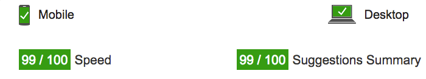
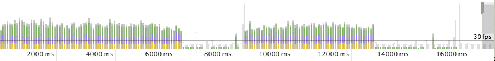
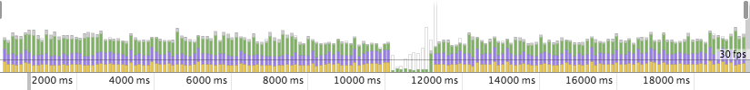
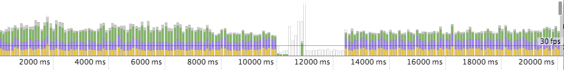
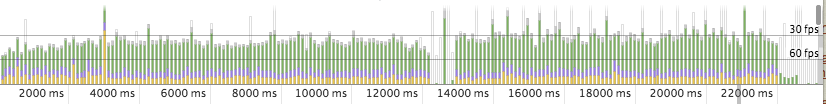
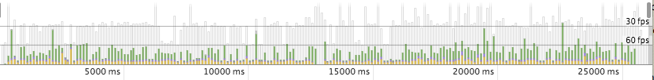
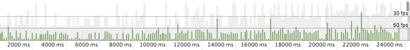
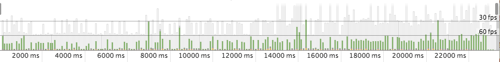
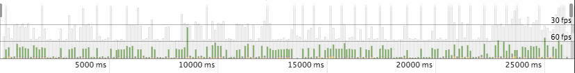

## 网站性能优化项目

你要做的是尽可能优化这个在线项目的速度。注意，请应用你之前在[网站性能优化课程](https://cn.udacity.com/course/website-performance-optimization--ud884/)中学习的技术来优化关键渲染路径并使这个页面尽可能快的渲染。

开始前，请导出这个代码库并检查代码。

### 指南

####Part 1: 优化 index.html 的 PageSpeed Insights 得分

以下是几个帮助你顺利开始本项目的提示：

1. 将这个代码库导出
2. 你可以运行一个本地服务器，以便在你的手机上检查这个站点

```bash
  $> cd /你的工程目录
  $> python -m SimpleHTTPServer 8080
```

1. 打开浏览器，访问 localhost:8080
2. 下载 [ngrok](https://ngrok.com/) 并将其安装在你的工程根目录下，让你的本地服务器能够被远程访问。

``` bash
  $> cd /你的工程目录
  $> ./ngrok http 8080
```

1. 复制ngrok提供给你的公共URL，然后尝试通过PageSpeed Insights访问它吧！可选阅读：[更多关于整合ngrok、Grunt和PageSpeed的信息](http://www.jamescryer.com/2014/06/12/grunt-pagespeed-and-ngrok-locally-testing/)。

接下来，你可以一遍又一遍的进行配置、优化、检测了！祝你好运！

----

####Part 2: 优化 pizza.html 的 FPS（每秒帧数）

你需要编辑 views/js/main.js 来优化 views/pizza.html，直到这个网页的 FPS 达到或超过 60fps。你会在 main.js 中找到一些对此有帮助的注释。

你可以在 Chrome 开发者工具帮助中找到关于 FPS 计数器和 HUD 显示的有用信息。[Chrome 开发者工具帮助](https://developer.chrome.com/devtools/docs/tips-and-tricks).

### 一些关于优化的提示与诀窍
* [web 性能优化](https://developers.google.com/web/fundamentals/performance/ "web 性能")
* [分析关键渲染路径](https://developers.google.com/web/fundamentals/performance/critical-rendering-path/analyzing-crp.html "分析关键渲染路径")
* [优化关键渲染路径](https://developers.google.com/web/fundamentals/performance/critical-rendering-path/optimizing-critical-rendering-path.html "优化关键渲染路径！")
* [避免 CSS 渲染阻塞](https://developers.google.com/web/fundamentals/performance/critical-rendering-path/render-blocking-css.html "css渲染阻塞")
* [优化 JavaScript](https://developers.google.com/web/fundamentals/performance/critical-rendering-path/adding-interactivity-with-javascript.html "javascript")
* [通过 Navigation Timing 进行检测](https://developers.google.com/web/fundamentals/performance/critical-rendering-path/measure-crp.html "nav timing api")。在前两个课程中我们没有学习 Navigation Timing API，但它对于自动分析页面性能是一个非常有用的工具。我强烈推荐你阅读它。
* <a href="https://developers.google.com/web/fundamentals/performance/optimizing-content-efficiency/eliminate-downloads.html">下载量越少，性能越好</a>
* <a href="https://developers.google.com/web/fundamentals/performance/optimizing-content-efficiency/optimize-encoding-and-transfer.html">减少文本的大小</a>
* <a href="https://developers.google.com/web/fundamentals/performance/optimizing-content-efficiency/image-optimization.html">优化图片</a>
* <a href="https://developers.google.com/web/fundamentals/performance/optimizing-content-efficiency/http-caching.html">HTTP缓存</a>

### 使用 Bootstrap 并定制样式
这个项目基于 Twitter 旗下的 <a href="http://getbootstrap.com/">Bootstrap框架</a> 制作。所有的定制样式都在项目代码库的 `dist/css/portfolio.css` 中。

* <a href="http://getbootstrap.com/css/">Bootstrap CSS</a>
* <a href="http://getbootstrap.com/components/">Bootstrap组件</a>

###### - Optimized Part1

```js
function updatePositions() {
  frame++;
  window.performance.mark("mark_start_frame");

  var items = document.querySelectorAll('.mover');
  for (var i = items.length; i--;) {
    var phase = Math.sin((document.body.scrollTop / 1250) + (i % 5));
    items[i].style.left = items[i].basicLeft + 100 * phase + 'px';
  }

  // User Timing API to the rescue again. Seriously, it's worth learning.
  // Super easy to create custom metrics.
  window.performance.mark("mark_end_frame");
  window.performance.measure("measure_frame_duration", "mark_start_frame", "mark_end_frame");
  if (frame % 10 === 0) {
    var timesToUpdatePosition = window.performance.getEntriesByName("measure_frame_duration");
    logAverageFrame(timesToUpdatePosition);
  }
}
```

```js
document.addEventListener('DOMContentLoaded', function() {
  var cols = 8;
  var s = 256;
  for (var i = 200; i--;) {
    var elem = document.createElement('img');
    elem.className = 'mover';
    elem.src = "../public/img/pizza.png";
    elem.style.height = "100px";
    elem.style.width = "73.333px";
    elem.basicLeft = (i % cols) * s;
    elem.style.top = (Math.floor(i / cols) * s) + 'px';
    document.querySelector("#movingPizzas1").appendChild(elem);
  }
  updatePositions();
});
```

###### - Optimized Part2


```js
document.addEventListener('DOMContentLoaded', function() {
  var cols = 8;
  var s = 256;
  for (var i = 31; i--;) {
    var elem = document.createElement('img');
    elem.className = 'mover';
    elem.src = "../public/img/pizza.png";
    elem.style.height = "100px";
    elem.style.width = "73.333px";
    elem.basicLeft = (i % cols) * s;
    elem.style.top = (Math.floor(i / cols) * s) + 'px';
    document.querySelector("#movingPizzas1").appendChild(elem);
  }
  updatePositions();
});
```

###### - ###### - Optimized Part3


```js
function updatePositions() {
  frame++;
  window.performance.mark("mark_start_frame");

  var items = document.querySelectorAll('.mover');
  for (var i = items.length; i--;) {
    var phase = Math.sin((document.body.scrollTop / 1250) + (i % 5));
    //items[i].style.left = items[i].basicLeft + 100 * phase + 'px';
    var left = -items[i].basicLeft + 1000 * phase + 'px';
 		items[i].style.transform = "translateX("+left+") translateZ(0)";
  }

  // User Timing API to the rescue again. Seriously, it's worth learning.
  // Super easy to create custom metrics.
  window.performance.mark("mark_end_frame");
  window.performance.measure("measure_frame_duration", "mark_start_frame", "mark_end_frame");
  if (frame % 10 === 0) {
    var timesToUpdatePosition = window.performance.getEntriesByName("measure_frame_duration");
    logAverageFrame(timesToUpdatePosition);
  }
}
```

###### - Optimized Part4


```js
function updatePositions() {
  frame++;
  window.performance.mark("mark_start_frame");

  var items = document.querySelectorAll('.mover');
  var top = (document.body.scrollTop / 1250);

  for (var i = items.length; i--;) {
    var phase = Math.sin( top + (i % 5));
    //items[i].style.left = items[i].basicLeft + 100 * phase + 'px';
    var left = -items[i].basicLeft + 1000 * phase + 'px';
 		items[i].style.transform = "translateX("+left+") translateZ(0)";
  }

  // User Timing API to the rescue again. Seriously, it's worth learning.
  // Super easy to create custom metrics.
  window.performance.mark("mark_end_frame");
  window.performance.measure("measure_frame_duration", "mark_start_frame", "mark_end_frame");
  if (frame % 10 === 0) {
    var timesToUpdatePosition = window.performance.getEntriesByName("measure_frame_duration");
    logAverageFrame(timesToUpdatePosition);
  }
}
```

###### - Optimized Part5

```js
document.addEventListener('DOMContentLoaded', function() {
  var cols = 8;
  var s = 256;
  for (var i = 31; i--;) {
    var elem = document.createElement('img');
    elem.className = 'mover';
    elem.src = "../public/img/pizza-slider.png";
    elem.basicLeft = (i % cols) * s;
    elem.style.top = (Math.floor(i / cols) * s) + 'px';
    document.querySelector("#movingPizzas1").appendChild(elem);
  }
  updatePositions();
});
```

###### - Optimized Part6

```js
window.addEventListener('scroll', function() {
	window.requestAnimationFrame(updatePositions);
});
```

###### - Optimized Part7

```js
function changePizzaSizes(size) {
	var dx = determineDx(document.querySelector(".randomPizzaContainer"), size);
  for (var i = 0; i < document.querySelectorAll(".randomPizzaContainer").length; i++) {
    var newwidth = (document.querySelectorAll(".randomPizzaContainer")[i].offsetWidth + dx) + 'px';
    document.querySelectorAll(".randomPizzaContainer")[i].style.width = newwidth;
  }
}
```

after

```js
function changePizzaSizes(size) {
	var dx = determineDx(document.querySelector(".randomPizzaContainer"), size);
	var newwidth = (document.querySelector(".randomPizzaContainer").offsetWidth + dx) + 'px';
  for (var i = 0; i < document.querySelectorAll(".randomPizzaContainer").length; i++) {
    document.querySelectorAll(".randomPizzaContainer")[i].style.width = newwidth;
  }
}
```

Then

```js
function changePizzaSizes(size) {
	var dx = determineDx(document.querySelector(".randomPizzaContainer"), size);
	var newwidth = (document.querySelector(".randomPizzaContainer").offsetWidth + dx) + 'px';
	var elements = document.querySelectorAll(".randomPizzaContainer");
  for (var i = 0; i < elements.length; i++) {
    elements[i].style.width = newwidth;
  }
}
```

###### - Optimized Part8

```js
function changePizzaSizes(size) {
	var dx = determineDx(document.querySelector(".randomPizzaContainer"), size);
	var newwidth = (document.querySelector(".randomPizzaContainer").offsetWidth + dx) + 'px';
	var elements = document.querySelectorAll(".randomPizzaContainer");
  for (var i = elements.length; i--;) {
    elements[i].style.width = newwidth;
  }
}
```

### Performance


















